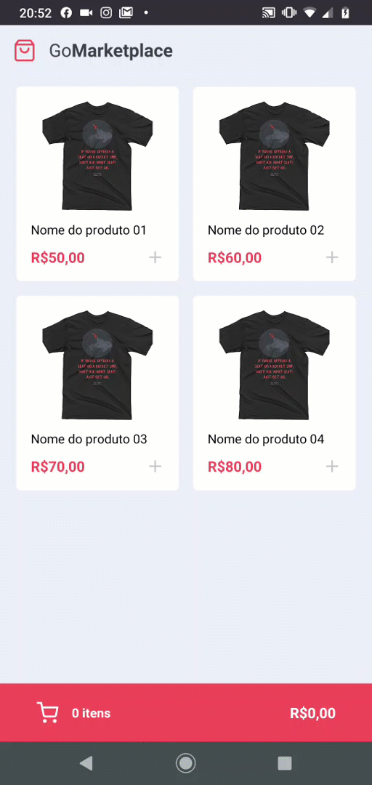

<h1 align="center">GoMarketplace</h1>
<p align="center">

</p>

<p align="center">This project has been built on the eighth challange of the Bootcamp GoStack from Rocketseat.</p>

<p align="center">
 <a href="#objective">Objective</a> •
 <a href="#technologies">Technologies</a> •
 <a href="#how-to-run">How to run the application</a> •
</p>

<h1 id="objective">:bulb: Objective</h1>
</p>This application is a simple simulation of an e-commerce built in React Native and using Context API. The app show a list of products and allows the user to increase or decrease the quantity of products in the cart and calculate the total price. The app use Async Storage to save the cart data.</p>

<h1 id="technologies">:rocket: Technologies</h1>

<p>It was used these technologies in this project.</p>

- [React Native](https://reactnative.dev/ "React Native")
- [Typescript](https://www.typescriptlang.org/ "Typescript")
- [Axios](https://github.com/axios/axios "Axios")
- [Eslint](https://eslint.org/ "Eslint")
- [Prettier](https://prettier.io/ "Prettier")
- [EditorConfig](https://editorconfig.org/ "EditorConfig")

<h1 id="how-to-run">:computer: How to run the application</h1>

<h2>Pre Requiriments</h2>

<p>You will need these tools instaled in your machine:</p>

- [Node.js](https://nodejs.org/en/ "Node.js")
- [Yarn](https://yarnpkg.com/ "Yarn")
- [Git](https://git-scm.com/ "Git")

```bash
# Clone this repository
$ git clone https://github.com/yesminmarie/gomarketplace

# Go into the folder of the project
$ cd gomarketplace

# Install the dependencies
$ yarn

# Start Metro Bundler
$ yarn start

# If you are using android run
$ yarn android

# If you are using ios run
$ yarn ios

# To initialize the Fake API run
$ json-server server.json -p 3333

# If the app doesn't show the products, run this command before start the emulate and before start the Fake API
$ adb reverse tcp:3333 tcp:3333

```
